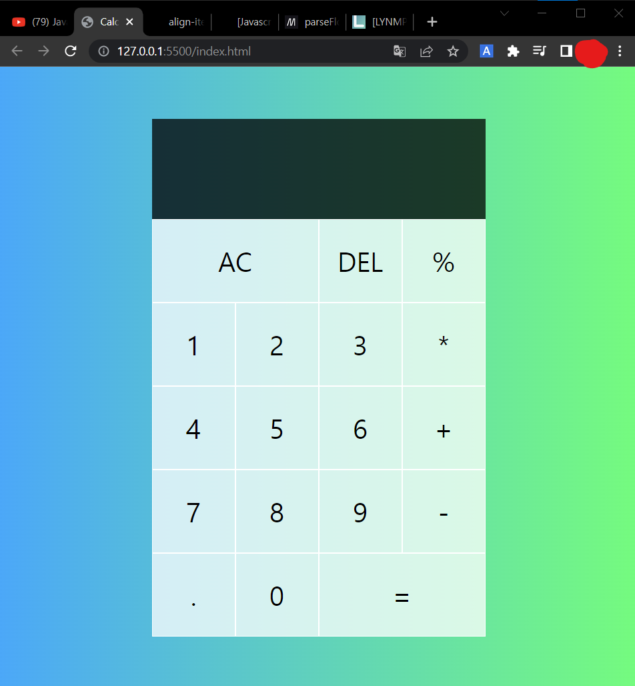
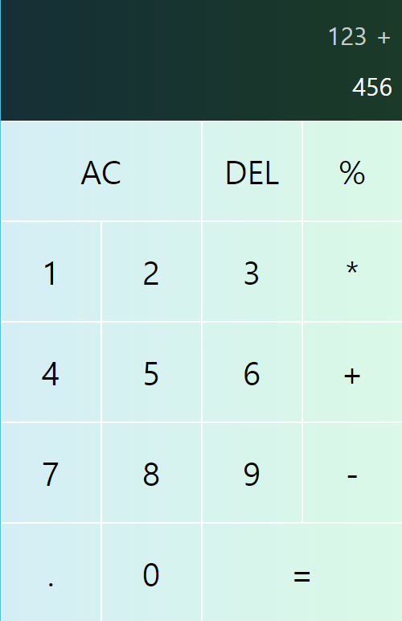

# Simple Calculator

### 기본적인 html과 css 학습 후 javascript 학습을 위해 [유튜브 튜토리얼](https://www.youtube.com/watch?v=j59qQ7YWLxw)을 보고 진행한 계산기 만들기.

  

## Features
- 간단한 사칙연산
- operation(+. -, *, %)클릭 시 그 전까지의 내용이 새로 입력할 내용과 분리
 "123+456 입력 시 화면"

## To-Do
- **line-by-line 주석 추가**
- html, css 활용, 외관 변형
- javascript 활용, 계산/출력 방식 수정 및 추가
  

## 느낀 점
유튜브에서 html과 css를 활용하여 홈페이지를 만드는 간단한 강의를 끝낸 후 바로 진행한 프로젝트이다.  

- `index.html` 작성은 따라가기 크게 어렵지 않았다.

- `styles.css` 작성시 `::before`, `::after`, `grid`, `flex` 등 아직 공부해야 할 부분이 많다고 느꼈다. 기능을 정확히 알지는 못했지만 코드를 추가/변형할 때 마다 `live-server` 활용 페이지의 변화를 보며 느낌을 파악했다.
- `script.js` 작성 시 역시 이해가 잘 되지 않았다. 어렴풋이 코딩 방식을 파악한 정도.
    - 한줄 한줄 주석을 달아가며 학습할 예정
